## MoilApp Application

*Date: 15/06/2021*

*Created by: Haryanto*


1. **Introduction**

   This application is support plugin for specific application such as 3D measurement, multiple view for ADAS, axis controller and etc. A plugin is a software component that adds a specific feature to an existing computer program. When a program supports plug-ins, it enables customization. 

   There are many benefits to building Apps with a plugin framework:

   - 3rd party developers can create and extend upon your App
   - new features are easier to develop
   - your application becomes smaller and easier to understand
   
   This is the ***newest version of MoilApp*** where previously we had version 1, version 2 and version 3. 


2. **How to run these apps**

   Follow this step before you use MoilApp,

   - Open your **Terminal** and **clone** this repository
      ```
      $ git clone https://github.com/MoilOrg/MoilApp.git
      ```
     Change **Directory** to the MoilApp folder
     
     ```
     $ cd MoilApp/
     ```
     
   - **Install all requirement** using bash script we provide by using this Command

     ```
     $ . build.sh
     ```
     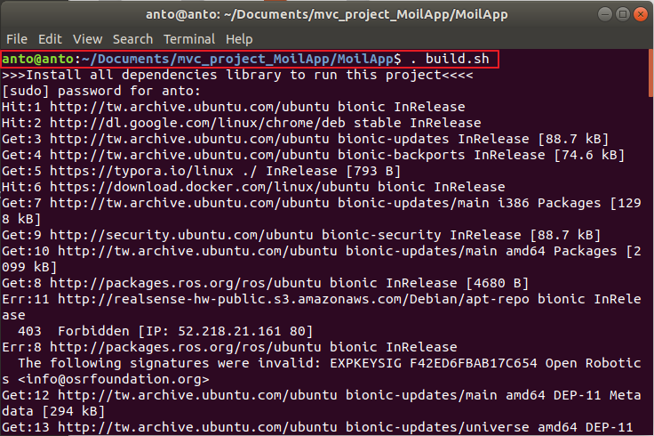

     

     If everything went well and you get a message like the one shown in the image below, it indicates that the installation of the requirements was successful.
   
     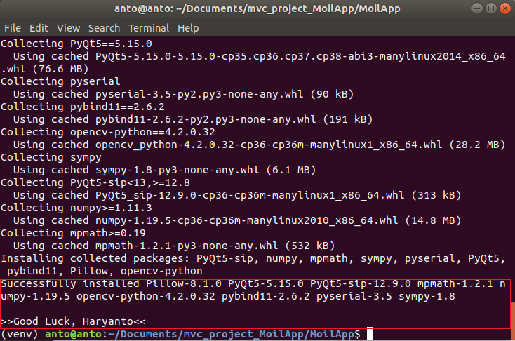
   
     

   - Running this project
     
     ```
     $ cd src/
     $ python main.py
     ```
     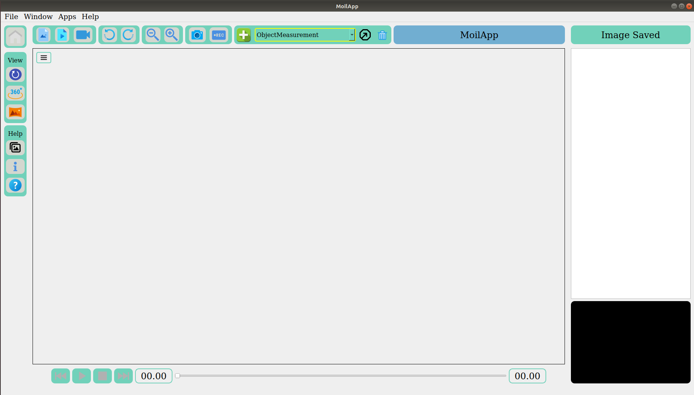  
   
     
   
     
     
      After you run this program, a display will appear as shown below.
     
     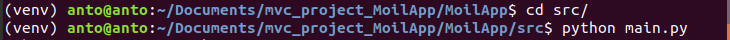
     
     


3. **Run MoilApp using PyCharm IDE**

   If you want to develop of modify the code of MoilApp you can use the **PyCharm IDE** and follow this step. Make sure the step Number 2 above was successfully execute.

   -  If you don't have PyChram IDE, you can open your terminal and type this command to install it
      ```
      $ sudo snap install pycharm-community --classic
      ```

   - Open PyCharm then open your **MoilApp** Repository in your directory by using PyChram IDE
     ```
     File > Open > Select File Directory MoilApp
     ```
     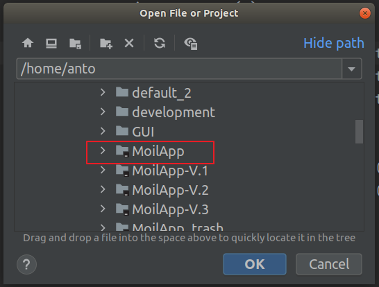

   - Set Interpreter
     ```
     File > Settings... > Select MoilApp > Project: MoilApp > Python Interpreter
     ```
     

   - Select Environment 
     
     Select this button 
     
     ```
     Select Add > Select Existing enverontment > Venv > bin > python3
     ```
     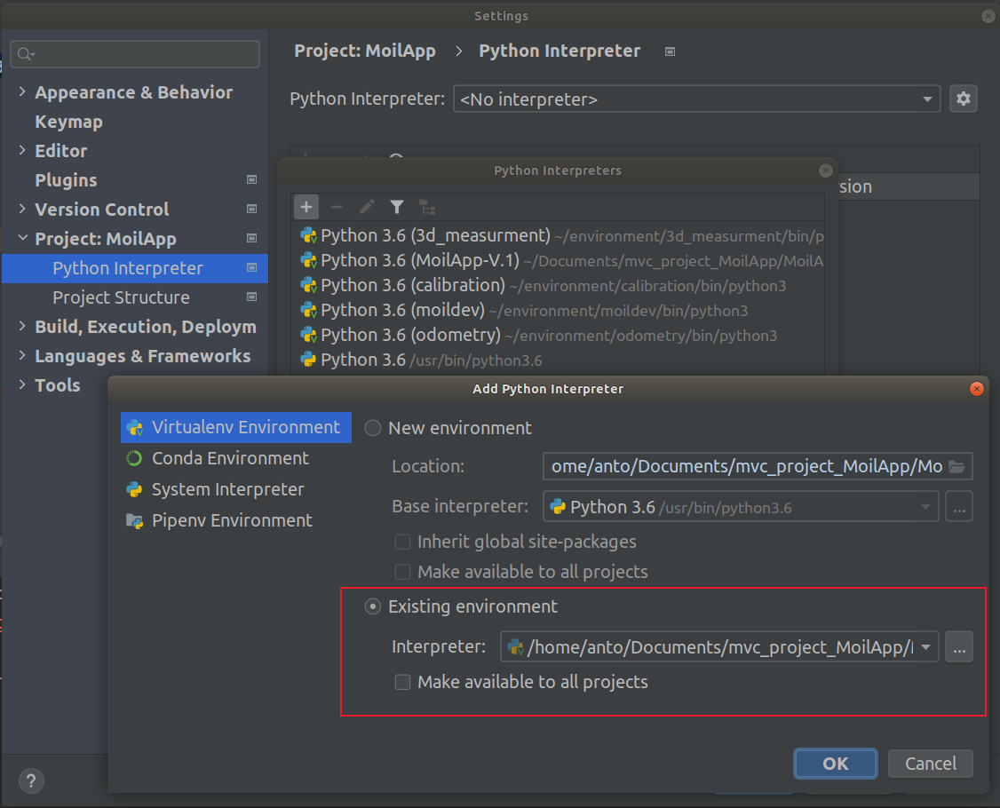
     
     
     
     Then you will show this path, select the python3 as your interpreter.
     
     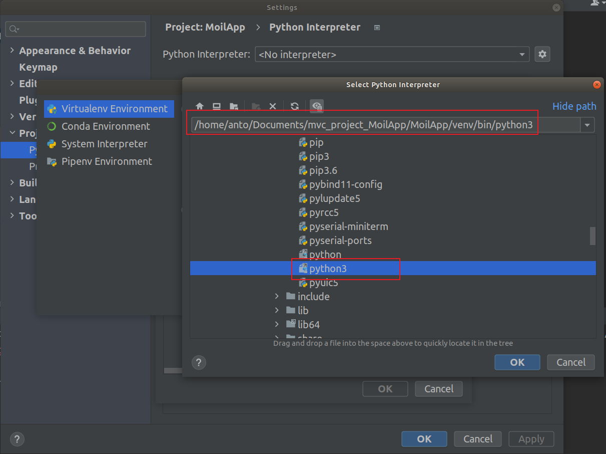
     
     
     
     After you click ok, your interpreter will available on the list like shown in below:
     
     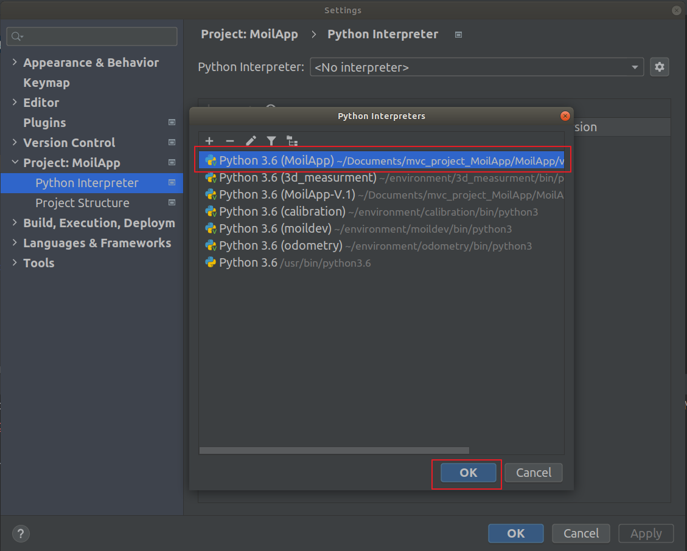
     
     
     
     Click ok, then it will show the library has been installed in this environment. you just need to click ok.
     
     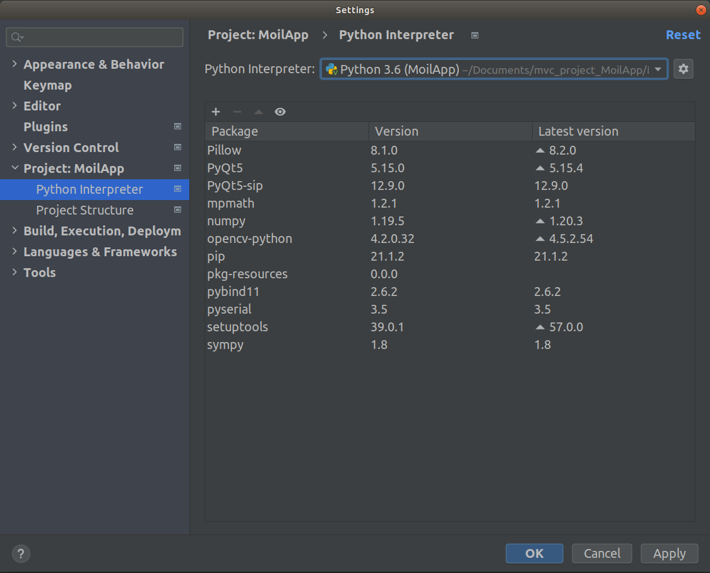
     
     
     
     The next step is add configuration to run the script path. you just need follow this guidance.  
     
     first you click the add configuration, 
     
     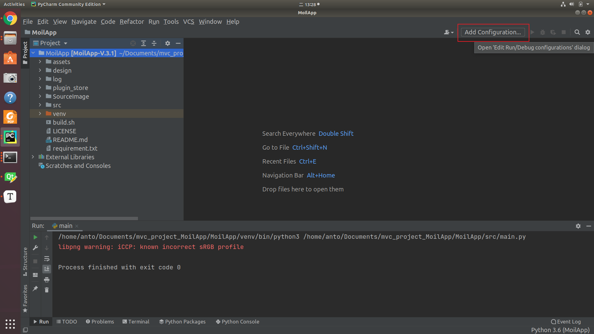
     
     
     
     Then click icon plus (+) and select python,
     
     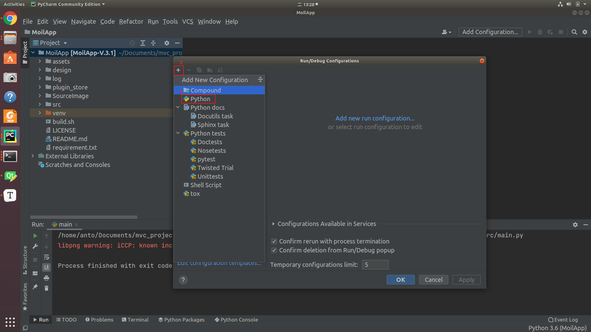
     
     
     
     Browse the main script path, here is "main.py" then click "ok"
     
     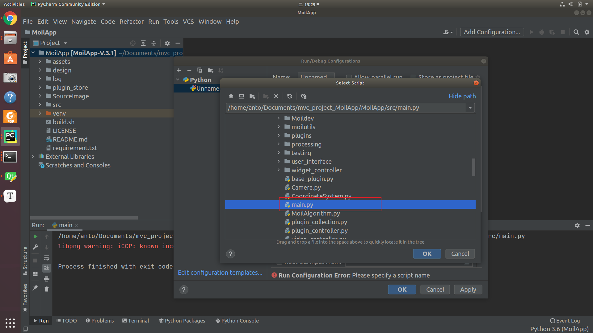
     
     
     
     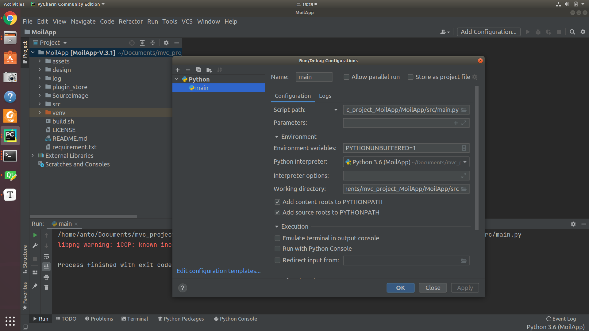
     
     

4. **Run Program using PyChram IDE**
   - Run the code, you just need click the button in red rectangle shape bellow this.
     
     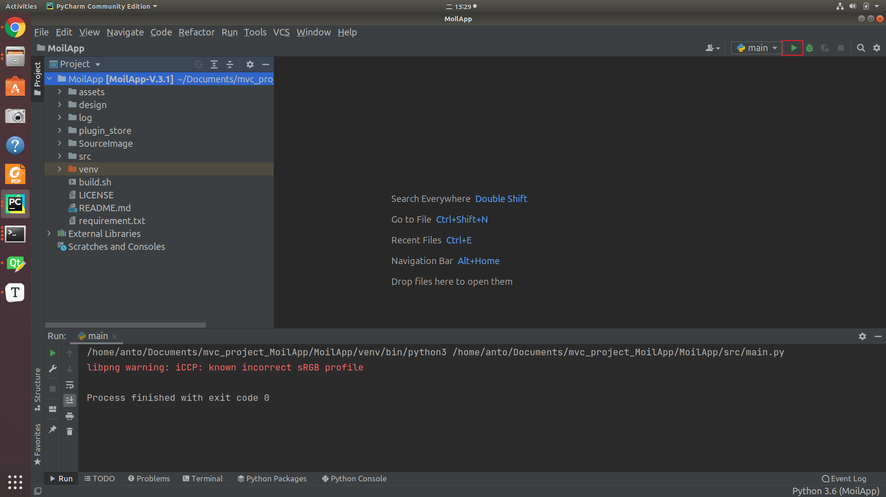
     
     
     
   - Program Running well
     Output program will be like this
     
     
     
     


5. **Introduction how to use this apps**

<<<<<<< HEAD
   You can watch the tutorial how to use this application here

   [](https://www.youtube.com/watch?v=irpWmNmgAz4)

   
=======
   You can watch the tutorial bellow to know how to use this application.
   
   [](https://youtu.be/irpWmNmgAz4)
>>>>>>> f2d46c74427d57f8cd958e4a249f87e0d41e52a3

6. For more documentation, **Contact US....**

